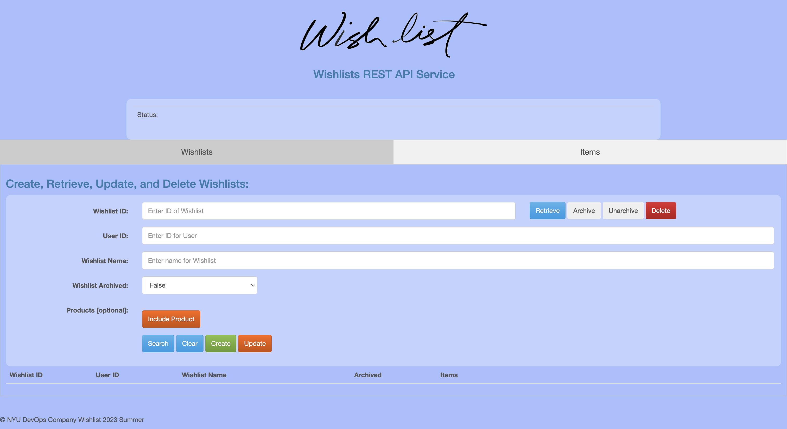
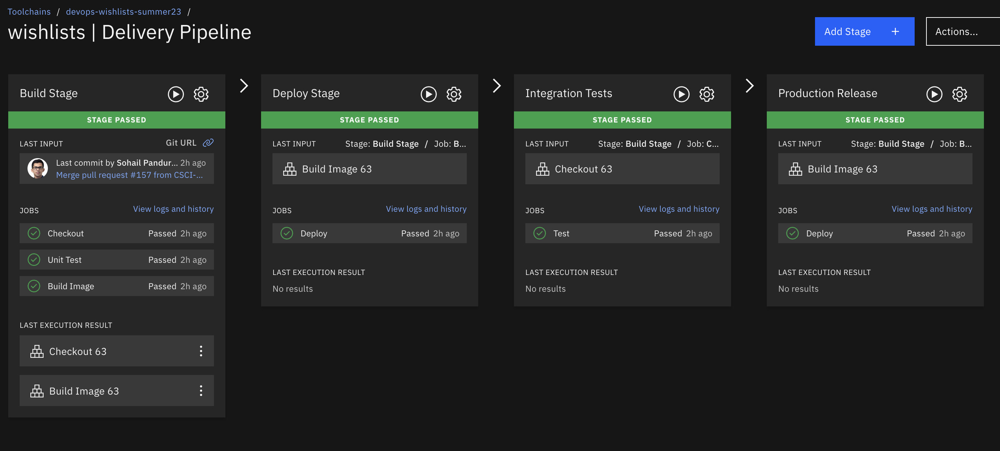
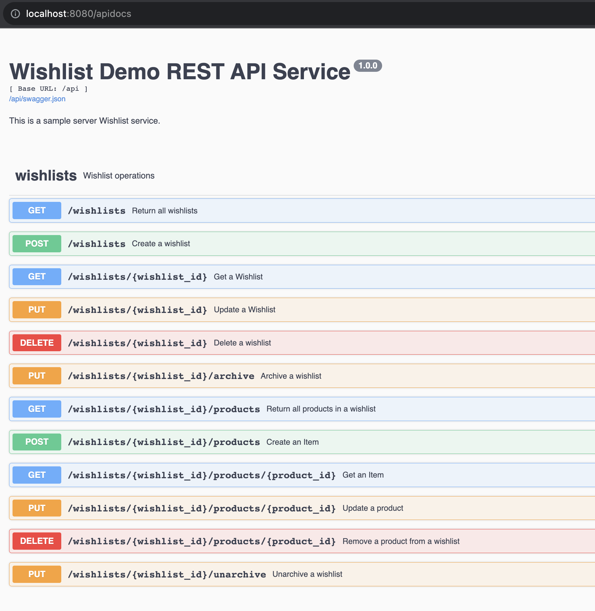

# NYU DevOps Project Template

[](https://github.com/CSCI-GA-2820-SU23-001/wishlists/actions)
[](https://github.com/CSCI-GA-2820-SU23-001/wishlists/actions)
[](https://codecov.io/gh/CSCI-GA-2820-SU23-001/wishlists)
[](https://opensource.org/licenses/Apache-2.0)
[](https://python.org/)

## Overview

Development of a eCommerce web application using microservices that offers five endpoints to handle wishlists and items within them. The project focuses on wishlists and items under them. Each endpoint should support CRUD (Create, Read, Update, Delete) operations, plus listing items making API calls.

To start, establish the development environment, database model was created using Postgres. URL was displayed in JSON format, including its name, version, and the URL for the list resource. Swagger/Open API documentation is added.

## Dev

[DEV- Click here to check it out](http://169.51.204.177:31001/)

## Prod

[PROD- Click here to check it out](http://169.51.204.177:31002/)

## Swagger Link

[SWAGGER- Click here to check it out](http://169.51.204.177:31002/apidocs)

## Website



## Cluster



## Swagger



## Files

The project contains the following:

```text
.gitignore          - this will ignore vagrant and other metadata files
.flaskenv           - Environment variables to configure Flask
.gitattributes      - File to gix Windows CRLF issues
.devcontainers/     - Folder with support for VSCode Remote Containers
dot-env-example     - copy to .env to use environment variables
requirements.txt    - list if Python libraries required by your code
config.py           - configuration parameters

service/                   - service python package
├── __init__.py            - package initializer
├── models.py              - module with business models
├── routes.py              - module with service routes
└── common                 - common code package
    ├── error_handlers.py  - HTTP error handling code
    ├── log_handlers.py    - logging setup code
    └── status.py          - HTTP status constants

tests/              - test cases package
├── __init__.py     - package initializer
├── test_models.py  - test suite for business models
└── test_routes.py  - test suite for service routes
```

## License

Copyright (c) John Rofrano. All rights reserved.

Licensed under the Apache License. See [LICENSE](LICENSE)

This repository is part of the NYU masters class: **CSCI-GA.2820-001 DevOps and Agile Methodologies** created and taught by _John Rofrano_, Adjunct Instructor, NYU Courant Institute, Graduate Division, Computer Science, and NYU Stern School of Business.
